# Mechanism-simulation-GUI
基于matlab下的app designer平台设计一款机构运动仿真GUI

**机构仿真运算终端系统****操作手册**

 

**开发平台：App Designer**

**开发者：Demons**

**联系渠道：Demonssssssss@outlook.com**

**版本号：V1.0**

**开发日期：2020.7.25**

 

**目录**

[一、机构仿真运算终端系统软件介绍. 1](#_Toc46578222)

[二、机构仿真运算终端系统软件使用流程. 2](#_Toc46578223)

[1、多机构选择. 2](#_Toc46578224)

[2、确定已知参数. 2](#_Toc46578225)

[3、运行仿真及数据导出. 4](#_Toc46578226)

[三、机构仿真运算终端系统其他扩展功能. 6](#_Toc46578227)

[1、正逆运动学的四足运动分析. 6](#_Toc46578228)

[2、栅格显示. 6](#_Toc46578229)

[3、帮助系统. 7](#_Toc46578230)

 

# 一、机构仿真运算终端系统软件介绍

  机构仿真运算终端系统是一款基于Matlab最新GUI开发平台app designer的机构分析软件。支持包括四杆机构、曲柄滑块机构、凸轮机构等机构运动仿真分析。可实时修改模型并运动仿真，导出运动线图数据流以及生成机构分析Microsoft Word报告模板，支持图片和Mat文件导入等功能，实现多机构的运动学分析。

  

##   1、以下是本系统的启动界面和软件图标

|  |  |
| :-------------------------------------: | :-------------------------------------: |
|                                         |                                         |

图1-1 启动界面及软件图标

 

##    2、以下是本系统的主窗口和子窗口界面

| 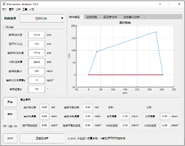 | 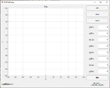 | 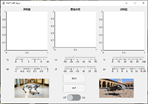 |
| --------------------------------------- | --------------------------------------- | --------------------------------------- |
|                                         |                                         |                                         |

图1-2 主窗口及子窗口环境

 

 

# 二、机构仿真运算终端系统软件使用流程

## 1、多机构选择

  双击机构仿真运算终端系统，进入软件主窗口环境，点击机构选择，选择所需分析机构。

 

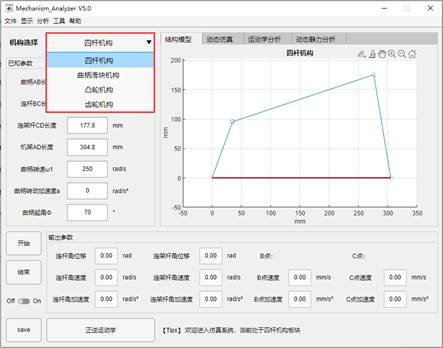

图2-1 主窗口界面

## 2、确定已知参数

  对于分析机构，软件保有默认参数，用户根据实际需求，更改已知参数进行运动仿真，目前已开放的参数输入渠道有三种。

**1、** **参数列表框直接修改数值**

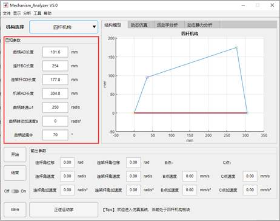

图2-2 参数数值输入

**2、** **手动线条绘制**

​    点击菜单栏中的“工具”选项，下拉选择进入“图形绘制”子窗口，

根据左下角的操作提示进行操作，同时右下角将实时显示光标坐标，辅助绘图。

| 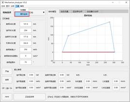 | 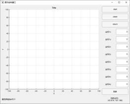 |
| --------------------------------------- | --------------------------------------- |
|                                         |                                         |

图2-3 图形绘制子窗口

**3、** **Mat****数据导入**

   **点击菜单栏的“文件”选项，在下拉框中选择“导入”下的“Mat文件”，选择本地文件夹下的Mat文件。**

 

| 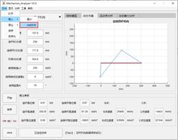 | 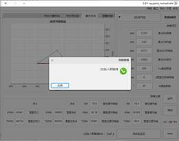 |
| --------------------------------------- | --------------------------------------- |
|                                         |                                         |

图2-4 Mat数据导入

## 3、运行仿真及数据导出

​       **1****、运行运动仿真**

​       点击主窗口下的“开始”按键，仿真开启，同时右下角显示Tips操作。仿真运动开启后，选择“运动仿真”一栏，观察运动动画，下方同时实时显示数据变化。

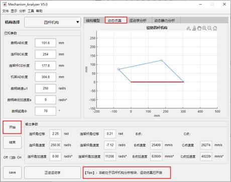

图2-5 运动仿真

​    同时左下方的其他按键可以实现，仿真暂停及仿真结束等功能。

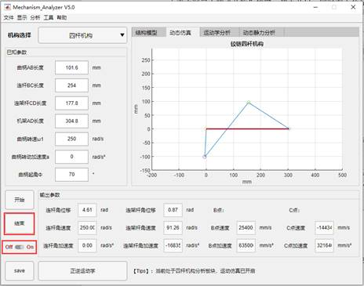

图2-6 暂停和结束功能

   **2****、保存数据并导出分析报告**

​    点击“运动学分析”一栏，再点击左下角的“save”按键保存数据，之后点击菜单栏中的“文件”，在下拉框中选择导出为“Microsoft Word”。

| 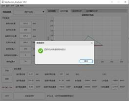 | 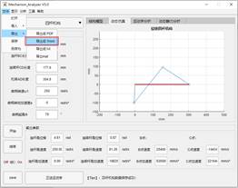 |
| --------------------------------------- | --------------------------------------- |
| 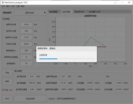 | 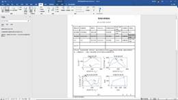 |

图2-7 数据导出

# 三、机构仿真运算终端系统其他扩展功能

## 1、正逆运动学的四足运动分析

  本系统内置四足正逆运动学足端分析功能，对机构的分析进一步加强。

  点击主窗口下的“正逆运动学”，进入正逆运动学窗口。该窗口下，可对摆线方程6个参数进行滑动设置，操作流程与前章所述一致。

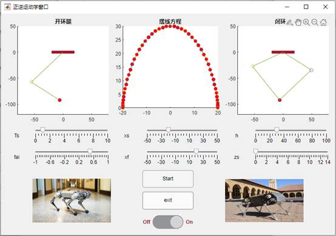

图3-1 正逆运动学分析

## 2、栅格显示

​    本系统目前支持坐标系的栅格显示修改，点击菜单栏的“显示”选项，在在下拉框中选择“网格显示”，可对系统中的坐标系栅格显示与否进行选择。

| 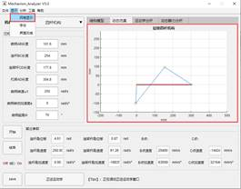 | 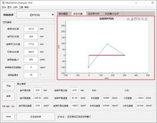 |
| --------------------------------------- | --------------------------------------- |
|                                         |                                         |

图3-2 栅格显示

 

## 3、帮助系统

  本系统为后续优化改进及用户使用疑问提供有效渠道和帮助。点击菜单栏中的“帮助”选项，有“帮助文档”及“app开发”选项，点进“帮助文档”可进入User Documents 文档（pdf）。

| 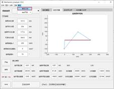 | 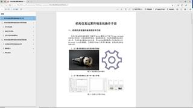 |
| --------------------------------------- | --------------------------------------- |
|                                         |                                         |

 图3-3 帮助文档

  同时开放开发者的相关联系方式，方便用户联系作者，提供功能修整及答疑活动。

| 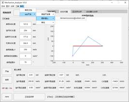 | 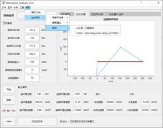 |
| --------------------------------------- | --------------------------------------- |
|                                         |                                         |

图3-4 联系方式